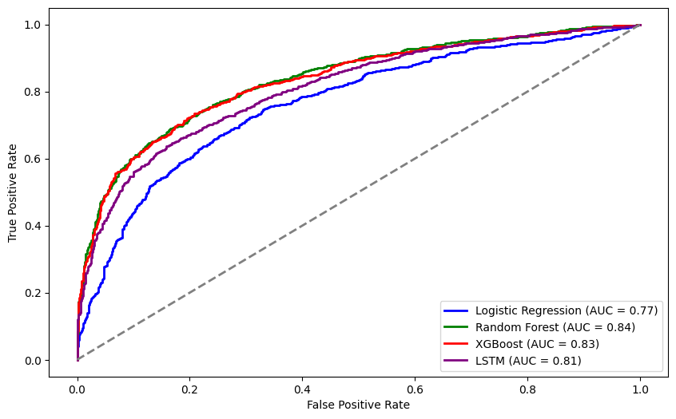

# ML | ECG Anomaly detection
    

<h2 align="center">
ECG Anomaly detection
</h2>

<a href="https://github.com/rakiiibul/MLECG/issues">Report
Bug</a> ·
<a href="https://github.com/rakiiibul/MLECG/issues">Request
Feature</a>

## Title: Anomaly Detection in Real-Time ECG Signals using Machine Learning

### Overview:

This Python Jupyter Notebook (`main.ipynb`) file under `code` folder  contains the implementation of an anomaly detection system for real-time Electrocardiogram (ECG) signals using machine learning models. This research addresses the critical domain of anomaly detection in real-time ECG signals, a pivotal aspect in healthcare monitoring. The study encompasses comprehensive data preprocessing, detailed analysis of ECG graphs, and the application of diverse machine learning models, including logistic regression, random forest, extreme gradient boosting, and LSTM. Among these, the Random Forest model emerged as the superior performer, showcasing precision, recall, and F1-score values for both normal and abnormal classifications. Model fairness analysis revealed variations across age groups, underscoring the need for tailored anomaly detection in different demographics. Informed by the model’s predictions, health advice recommendations were derived, emphasizing personalized interventions. For senior adults, a heightened sensitivity to abnormal heartbeats suggests the importance of regular medical assessments. Conversely, for younger age groups, lifestyle recommendations focus on heart-healthy practices. The study also proposes future work, including enhanced feature engineering and exploration of deep learning architectures, to further refine anomaly detection models. The research underscores the significance of collaboration with healthcare professionals, ethical considerations, and regular model updates for successful integration into clinical practice. These recommendations, derived from a holistic analysis, contribute not only to the advancement of anomaly detection in ECG signals but also offer actionable insights for personalized healthcare interventions.

### Result
</a>

### Requirements:

- Python 3.x
- Jupyter Notebook
- Required Python libraries (specified in the notebook)

### Usage:

1. Open the Jupyter Notebook file: `main.ipynb`
2. Link the dataset,`data.csv` and Run the cells sequentially to execute the code.
3. Review the results, visualizations, and analysis provided in the notebook.

### Note:

- This project is a part of ongoing research, and feedback is welcome.
- For any questions or concerns, please contact with me at [therakiiibul@outlook.com].

Feel free to explore the notebook and share your insights!
